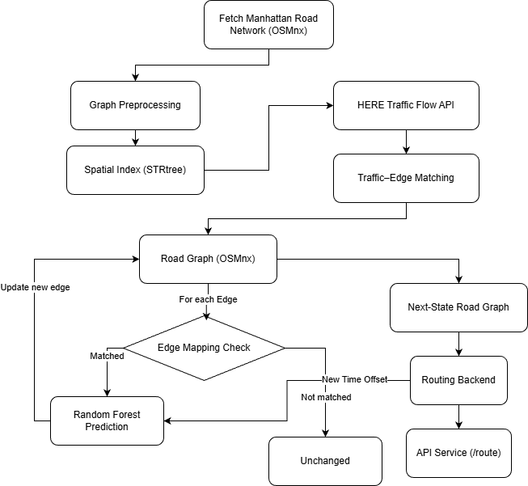

# Predictive Navigation Software

This project implements a predictive navigation system, including a baseline navigation backend and experimental machine-learning–based speed prediction models.

---

## How to Run the Basic Navigation

- `1. Backend`  
  First run the backend, app.py(recommended) or app_with_ml.py with the code **python app.py(app_with_ml.py)**
  
- `2. Frontend`  
  TThen navigate to the frontend directory and start a local server: using **python -m http.server 5500**. Open your browser and visit: **http://localhost:5500**

---

## Overall File Structure

---

## File Descriptions

### Backend Code (Final Versions)

- `final/app.py`  
  This is the **recommended backend version for testing**.  
  During testing, please use this file as the backend service.  
  It does not perform machine learning inference and provides stable and fast responses.

- `final/app_with_ml.py`  
  This version includes **Random Forest–based inference** for predictive navigation.  
  However, the Random Forest inference is **too slow for practical testing**, so this version is not recommended for runtime evaluation.

- `ml_test.ipynb`  
  This notebook contains function-level tests for the machine learning components.  
  The **last execution cell** in the notebook shows the relevant test results.
  
- `final/build_graph.py`  
  This is the file used to download manhattan map which can also work on other area for furthur extenstion. 
---

### Data Files

- `here*.parquet`  
  Files with names starting with `here` are Manhattan road datasets collected via the **HERE API**.  
  The data was collected **once per minute over a 30-minute period**.

  - The data collection code is located in:
    - `rf_model_training.ipynb`
  - Random Forest model training and all related hyperparameters are also defined in this notebook.

- `manhattan*` (e.g., `manhattan_1month_speed`)  
  Files with names starting with `manhattan` were previously downloaded from **NYC Open Data**.  
  Dataset used: **DOT – Traffic Speeds (NBE)**.  
  These datasets were originally used for experiments with the **Chronos Bolt Tiny** model.

---

### Machine Learning Models

- `rf*`  
  Files with names starting with `rf` store the **trained Random Forest models** used in this project.

- `here_chronos_bolt_tiny`  
  This directory contains the **trained Chronos Bolt Tiny model**.  
  Although this model provides **faster inference**, it cannot be executed due to environment compatibility issues.

- `chronos_bolt_tiny_training (not used due to environment setting).ipynb`  
  This notebook includes the original data collection and training pipeline for the Chronos Bolt Tiny model.  
  It is preserved for reference only and is **not used in the final system** due to environment constraints.

---

## Notes

- For backend testing and demonstrations, please use `final/app.py`.
- Machine learning inference is currently experimental and mainly documented through notebooks rather than real-time deployment.

## Introduction Video

- You can get more detailed information in our introduction video on YouTube:
